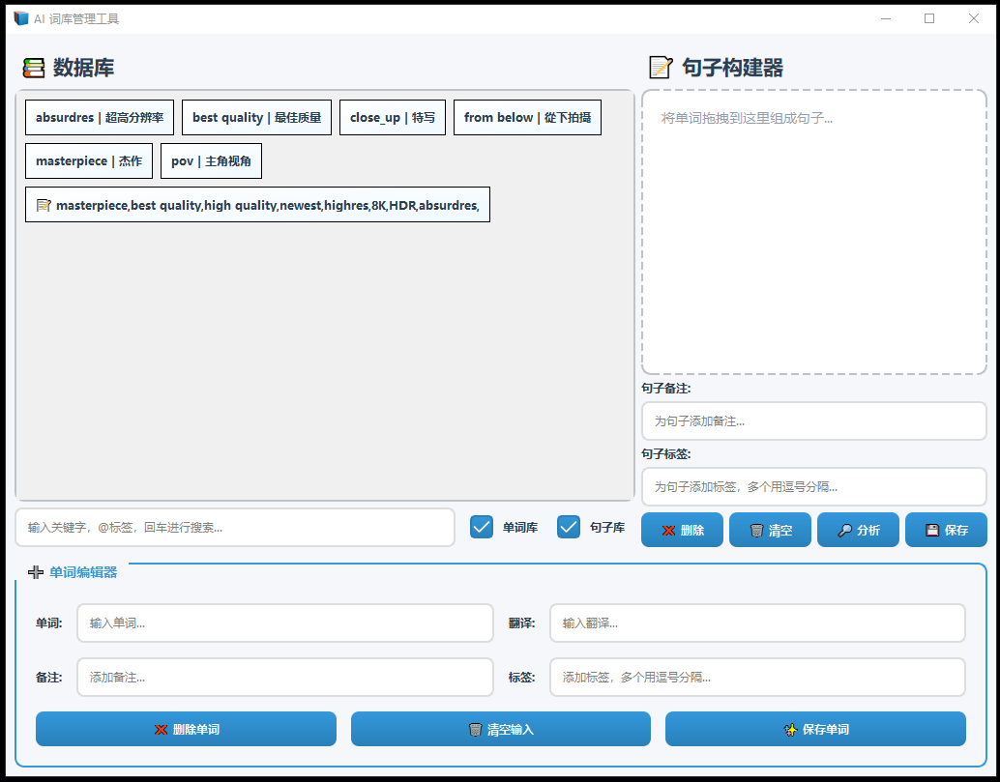
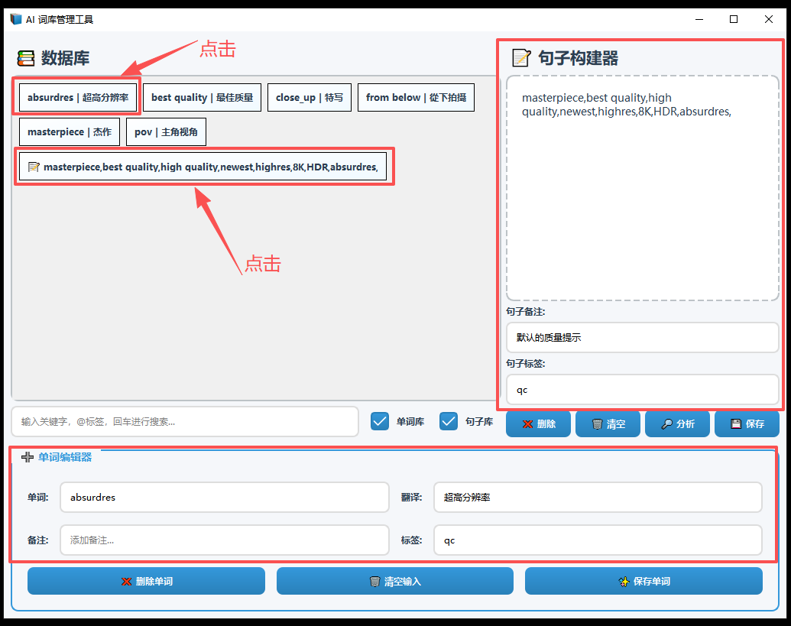
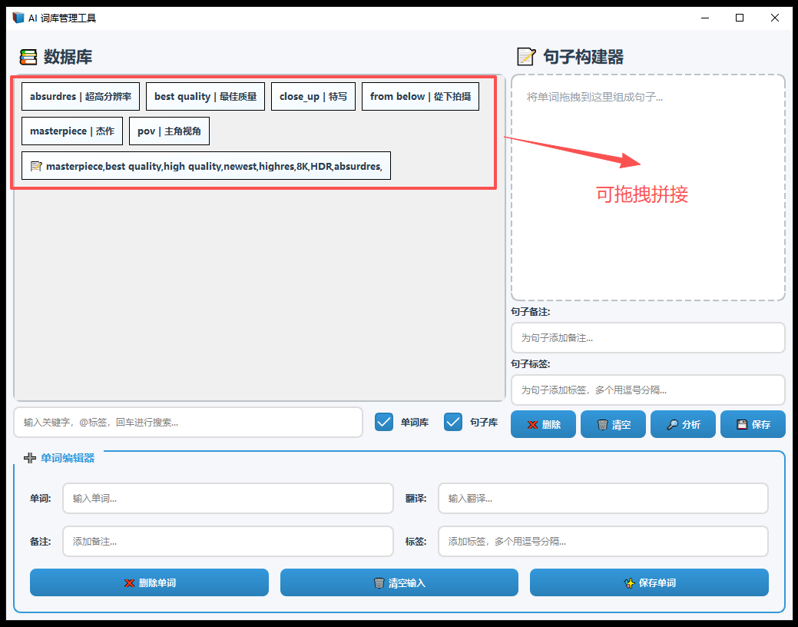
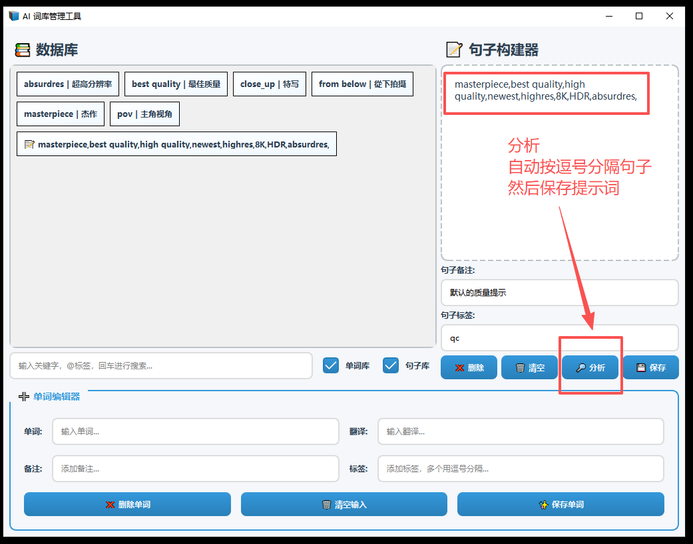
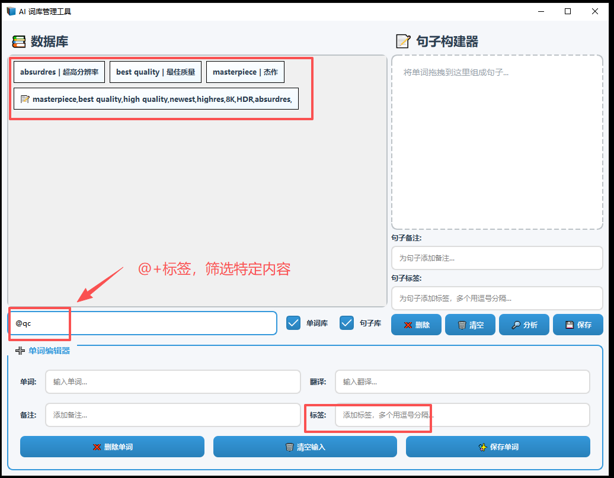
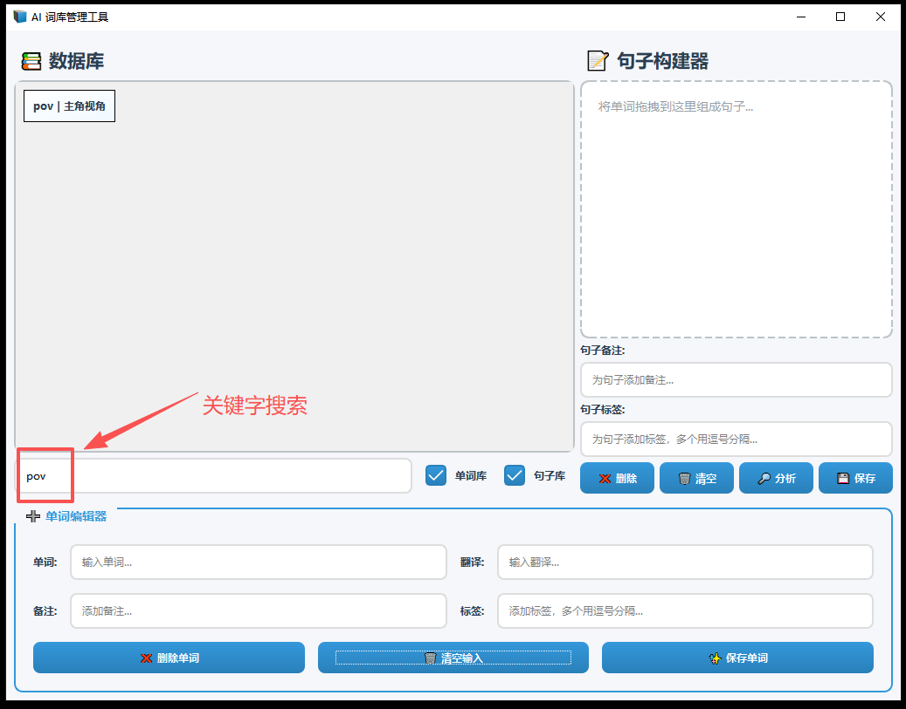

# AI 提示词管理工具（AiPromptManager）

## 前言

这个工具是使用 Pyside6 用于练手的一个小项目，因此程序主要代码都在 `main.py` 这个文件里面，结构很简单的。

如果想要修改或者学习，可以先从 `designerUi` 这个文件夹开始，这个文件夹内存放这整个软件的所有界面设计文件，推荐直接使用 `QtDesigner` 进行打开。

然后 `designerQrc` 是界面设计中用到的一些 LOGO 图片文件，`codingUi, codingQrc` 则是通过 `uic` 和 `rcc` 工具自动生成的代码文件。

然后这里的数据为了简单，直接采用一个 JSON 文件做数据存储了，懒得搞数据库了，所以会在运行程序后，在程序当前位置生成一个 `database.json` 文件。

最后，这个软件具备包括单词添加，句子构建，句子拖拽构建，句子分割，标签标记，搜索在内的简单功能。

## 图示













## 项目打包

这里使用 nuitka 进行项目打包，请执行以下命令语句：

```cmd
python -m nuitka --onefile --standalone `
--windows-icon-from-ico=resources/bookshelf.ico `
--copyright=LL@LiangMingJian --product-name=AiPromptManager `
--file-version=1.0 --file-description=AiPromptManager `
--enable-plugin=pyside6 --windows-console-mode=disable `
--output-filename=AiPromptManager.exe main.py
```

## No.1

注意，UI 文件中存在表情，在 Windows 环境下，由于系统默认编码不是 UTF-8 所以会导致使用 pyside6-uic 直接转换时，生成的 Python 文件会有异常。

因此，需要先在终端中切换编码为 UTF-8，然后才能进行转换。

```cmd
chcp 65001
pyside6-uic.exe main.ui -o main_ui.py
```

## No.2

Qt Designer 的组件 QSplitter（分类器）需要选中需要分离的那两个组件，然后通过布局选中”使用拆分器水平拆分“进行使用。

## No.3

按钮组件在鼠标悬浮时的手势设置可以在 Qt Designer 对应组件中的 QWidget cursor 进行设置，而不需设置 QCSS。

## No.4

以下两种初始化方法都是一样的效果，其中第一种是 Python2 的兼容写法，第二种是简化写法。

```python
# Python2 兼容
def __init__(self, word_data):
    super(WordCard, self).__init__()
    self.ui = Ui_WordCard()
    self.ui.setupUi(self)

# Python3 简化
def __init__(self, word_data):
    super().__init__()
    self.ui = Ui_WordCard()
    self.ui.setupUi(self)
```

## No.5

QMimeData 是 Qt 框架中用于在拖放操作和剪贴板功能中传递数据的核心类。

QMimeData() 用于创建一个空的 QMimeData 对象，该对象可存储多种格式的数据（如文本、图像、URL 等），并确保数据在不同组件或应用间安全传输。

```python
drag = QDrag(self)
mime_data = QMimeData()
mime_data.setText(words)
drag.setMimeData(mime_data)
drag.exec(Qt.MoveAction)
```

## No.6

嵌套的布局需要使用迭代进行删除，否则无法删除嵌套布局下的子控件。

```python
def clean_cards(self, widget):
    while widget.count():
        child = widget.takeAt(0)
        if child.widget():
            child.widget().deleteLater()
        elif child.layout():
            self.clean_cards(child)
```

## No.7

水平布局可以通过 layoutStretch 控制布局所占据空间的比例，比如（80, 20）

## No.8

lineEdit 回车输入信号为 returnpass
